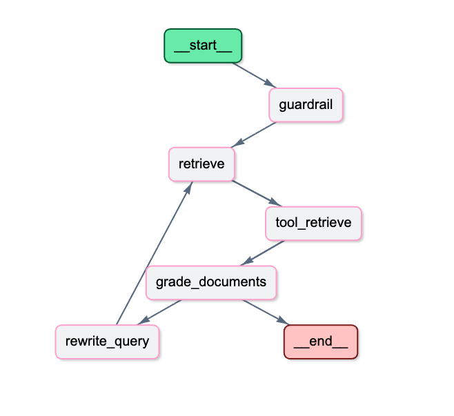
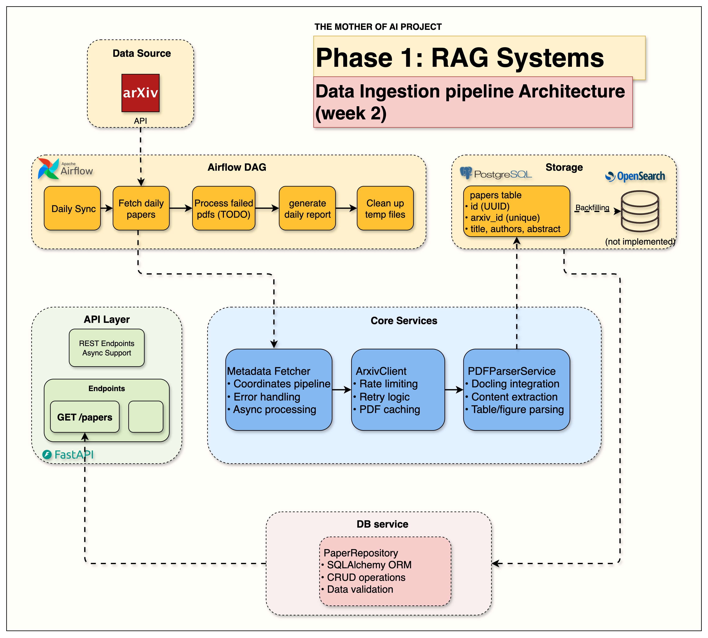

# The Mother of AI Project
## Phase 1 RAG Systems: arXiv Paper Curator

<div align="center">
  <h3>A Learner-Focused Journey into Production RAG Systems</h3>
  <p>Learn to build modern AI systems from the ground up through hands-on implementation</p>
  <p>Master the most in-demand AI engineering skills: <strong>RAG (Retrieval-Augmented Generation)</strong></p>
</div>

<p align="center">
  
  
  
  
  
  
</p>

</br>

<p align="center">
  <a href="#-about-this-course">
    
  </a>
</p>

## 📖 About This Course

This is a **learner-focused project** where you'll build a complete research assistant system that automatically fetches academic papers, understands their content, and answers your research questions using advanced RAG techniques.

**The arXiv Paper Curator** will teach you to build a **production-grade RAG system using industry best practices**. Unlike tutorials that jump straight to vector search, we follow the **professional path**: master keyword search foundations first, then enhance with vectors for hybrid retrieval.

> **🎯 The Professional Difference:** We build RAG systems the way successful companies do — solid search foundations enhanced with AI, not AI-first approaches that ignore search fundamentals.

By the end of this course, you'll have your own AI research assistant and the deep technical skills to build production RAG systems for any domain.

### **🎓 What You'll Build**

- **Phase 1:** Complete infrastructure with Docker, FastAPI, Neon PostgreSQL, OpenSearch, and Airflow
- **Phase 2:** Automated data pipeline fetching and parsing academic papers from arXiv
- **Phase 3:** Production BM25 keyword search with filtering and relevance scoring
- **Phase 4:** Intelligent chunking + hybrid search combining keywords with semantic understanding
- **Phase 5:** Complete RAG pipeline with OpenAI API, streaming responses, and Gradio interface
- **Phase 6:** Production monitoring with Langfuse Cloud tracing and Upstash Redis caching
- **Phase 7:** **Agentic RAG with LangGraph and Telegram Bot for mobile access**

---

## 🏗️ System Architecture

### Phase 7: Agentic RAG & Telegram Bot Integration
<div align="center">
  
  <p><em>Complete Phase 7 architecture showing Telegram bot integration with the agentic RAG system</em></p>
</div>

### LangGraph Agentic RAG Workflow
<div align="center">
  
  <p><em>Detailed LangGraph workflow showing decision nodes, document grading, and adaptive retrieval</em></p>
</div>

**Phase 7 Code walkthrough + blog:** [Agentic RAG with LangGraph and Telegram](https://jamwithai.substack.com/p/agentic-rag-with-langgraph-and-telegram)

**Key Innovations in Phase 7:**
- **Intelligent Decision-Making:** Agents evaluate and adapt retrieval strategies
- **Document Grading:** Automatic relevance assessment with semantic evaluation
- **Query Rewriting:** Adaptive query refinement when results are insufficient
- **Guardrails:** Out-of-domain detection prevents hallucination
- **Mobile Access:** Telegram bot for conversational AI on any device
- **Transparency:** Full reasoning step tracking for debugging and trust

---

## 🚀 Quick Start

### **📋 Prerequisites**

**Tools:**
- **Docker Desktop** (with Docker Compose)
- **Python 3.12+**
- **UV Package Manager** ([Install Guide](https://docs.astral.sh/uv/getting-started/installation/))

**Cloud Accounts (all free tiers):**
- **OpenAI** — LLM generation → [platform.openai.com](https://platform.openai.com)
- **Jina AI** — Vector embeddings (Phase 4+) → [jina.ai](https://jina.ai)
- **Neon** — Serverless PostgreSQL → [console.neon.tech](https://console.neon.tech)
- **Upstash** — Serverless Redis → [console.upstash.com](https://console.upstash.com)
- **Langfuse Cloud** — Tracing & observability → [cloud.langfuse.com](https://cloud.langfuse.com)

**Hardware:** 6GB+ RAM, 5GB+ free disk space

> **Why cloud services?** Running PostgreSQL, Redis, Langfuse (6 containers!), and a local LLM simultaneously requires 16GB+ RAM. By moving these to managed cloud free tiers, the local stack shrinks to **4 containers** — accessible on any machine.

### **⚡ Get Started**

```bash
# 1. Clone and switch to the develop branch
git clone https://github.com/jamwithai/Agentic-RAG-project
cd Agentic-RAG-project
git checkout develop

# 2. Install dependencies
uv sync

# 3. Create your .env file with real credentials
# (See step-by-step.md → Step 3 for the full template)
# Key variables needed:
#   OPENAI_API_KEY, POSTGRES_DATABASE_URL (Neon),
#   REDIS__URL (Upstash TCP), LANGFUSE__PUBLIC_KEY,
#   LANGFUSE__SECRET_KEY, JINA_API_KEY

# 4. Verify all cloud APIs are reachable
uv run python scripts/test_connections.py

# 5. Start the 4 local containers
docker compose up --build -d

# 6. Verify everything works
curl http://localhost:8000/api/v1/health
```

> **Important:** Do not `cp .env.example .env` — the example contains placeholder values. Create `.env` fresh with your real credentials. See [step-by-step.md](step-by-step.md) for the exact template.

### **📚 Phase Learning Path**

| Phase | Topic | Blog Post | Code Release |
|-------|-------|-----------|--------------|
| **Phase 0** | The Mother of AI project — overview | [The Mother of AI project](https://jamwithai.substack.com/p/the-mother-of-ai-project) | — |
| **Phase 1** | Infrastructure Foundation | [The Infrastructure That Powers RAG Systems](https://jamwithai.substack.com/p/the-infrastructure-that-powers-rag) | [phase1.0](https://github.com/jamwithai/Agentic-RAG-project/releases/tag/phase1.0) |
| **Phase 2** | Data Ingestion Pipeline | [Building Data Ingestion Pipelines for RAG](https://jamwithai.substack.com/p/bringing-your-rag-system-to-life) | [phase2.0](https://github.com/jamwithai/Agentic-RAG-project/releases/tag/phase2.0) |
| **Phase 3** | OpenSearch BM25 Retrieval | [The Search Foundation Every RAG System Needs](https://jamwithai.substack.com/p/the-search-foundation-every-rag-system) | [phase3.0](https://github.com/jamwithai/Agentic-RAG-project/releases/tag/phase3.0) |
| **Phase 4** | **Chunking & Hybrid Search** | [The Chunking Strategy That Makes Hybrid Search Work](https://jamwithai.substack.com/p/chunking-strategies-and-hybrid-rag) | [phase4.0](https://github.com/jamwithai/Agentic-RAG-project/releases/tag/phase4.0) |
| **Phase 5** | **Complete RAG system** | [The Complete RAG System](https://jamwithai.substack.com/p/the-complete-rag-system) | [phase5.0](https://github.com/jamwithai/Agentic-RAG-project/releases/tag/phase5.0) |
| **Phase 6** | **Production monitoring & caching** | [Production-ready RAG: Monitoring & Caching](https://jamwithai.substack.com/p/production-ready-rag-monitoring-and) | [phase6.0](https://github.com/jamwithai/Agentic-RAG-project/releases/tag/phase6.0) |
| **Phase 7** | **Agentic RAG & Telegram Bot** | [Agentic RAG with LangGraph and Telegram](https://jamwithai.substack.com/p/agentic-rag-with-langgraph-and-telegram) | [phase7.0](https://github.com/jamwithai/Agentic-RAG-project/releases/tag/phase7.0) |

**📥 Clone a specific phase's release:**
```bash
git clone --branch <PHASE_TAG> https://github.com/jamwithai/Agentic-RAG-project
cd Agentic-RAG-project
uv sync
docker compose down -v
docker compose up --build -d

# Replace <PHASE_TAG> with: phase1.0, phase2.0, phase3.0 ...
```

### **📊 Access Your Services**

| Service | URL | Purpose |
|---------|-----|---------|
| **API Documentation** | http://localhost:8000/docs | Interactive API testing |
| **Gradio RAG Interface** | http://localhost:7861 | User-friendly chat interface |
| **Airflow Dashboard** | http://localhost:8080 | Workflow management (admin/admin) |
| **OpenSearch Dashboards** | http://localhost:5601 | Search engine UI |
| **Langfuse Cloud** | https://us.cloud.langfuse.com | RAG pipeline tracing |

---

## 📚 Phase 1: Infrastructure Foundation ✅

**Start here!** Master the infrastructure that powers modern RAG systems.

### **🎯 Learning Objectives**
- Complete infrastructure setup with Docker Compose (4 local containers)
- FastAPI development with automatic documentation and health checks
- Cloud database configuration — Neon serverless PostgreSQL
- OpenSearch hybrid search engine setup
- Service orchestration and health monitoring
- Professional development environment with code quality tools

### **🏗️ Architecture Overview**

<p align="center">
  
</p>

**Infrastructure Components:**

| Component | Where | Port |
|-----------|-------|------|
| **FastAPI** | Docker (local) | 8000 |
| **OpenSearch 2.19.5** | Docker (local) | 9200, 5601 |
| **Apache Airflow 2.10.3** | Docker (local) | 8080 |
| **Neon PostgreSQL** | Cloud (managed) | — |

### **📓 Setup Guide**

```bash
uv run jupyter notebook notebooks/phase1/phase1_setup.ipynb
```

### **📖 Deep Dive**
**Blog Post:** [The Infrastructure That Powers RAG Systems](https://jamwithai.substack.com/p/the-infrastructure-that-powers-rag)

---

## 📚 Phase 2: Data Ingestion Pipeline ✅

**Building on Phase 1:** Learn to fetch, process, and store academic papers automatically.

### **🎯 Learning Objectives**
- arXiv API integration with rate limiting and retry logic
- Scientific PDF parsing using Docling
- Automated data ingestion pipelines with Apache Airflow
- Metadata extraction and storage workflows
- Complete paper processing from API to database

### **🏗️ Architecture Overview**

<p align="center">
  
</p>

**Data Pipeline Components:**
- **MetadataFetcher** — main orchestrator coordinating the entire pipeline
- **ArxivClient** — rate-limited paper fetching with retry logic
- **PDFParserService** — Docling-powered scientific document processing
- **Airflow DAGs** — automated daily paper ingestion (Monday–Friday, 6 AM UTC)
- **Neon PostgreSQL** — structured paper metadata and content storage

### **📓 Implementation Guide**

```bash
uv run jupyter notebook notebooks/phase2/phase2_arxiv_integration.ipynb
```

### **📖 Deep Dive**
**Blog Post:** [Building Data Ingestion Pipelines for RAG](https://jamwithai.substack.com/p/bringing-your-rag-system-to-life)

---

## 📚 Phase 3: Keyword Search First — The Critical Foundation

**Building on Phases 1–2:** Implement the keyword search foundation that professional RAG systems rely on.

### **🎯 Learning Objectives**
- Why keyword search is essential for RAG systems
- OpenSearch index management, mappings, and search optimization
- BM25 algorithm and the math behind effective keyword search
- Query DSL for complex search queries with filters and boosting
- Search analytics for measuring relevance and performance

### **🏗️ Architecture Overview**

<p align="center">
  
</p>

### **📓 Setup Guide**

```bash
uv run jupyter notebook notebooks/phase3/phase3_opensearch.ipynb
```

### **📖 Deep Dive**
**Blog Post:** [The Search Foundation Every RAG System Needs](https://jamwithai.substack.com/p/the-search-foundation-every-rag-system)

---

## 📚 Phase 4: Chunking & Hybrid Search — The Semantic Layer

**Building on Phase 3:** Add the semantic layer that makes search truly intelligent.

### **🎯 Learning Objectives**
- Section-based chunking with intelligent document segmentation
- Production embeddings with Jina AI (1024-dimensional vectors)
- Hybrid search using RRF fusion for keyword + semantic retrieval
- Unified API design with single endpoint supporting multiple search modes
- Performance analysis between search approaches

### **🏗️ Architecture Overview**

<p align="center">
  
</p>

**Hybrid Search Components:**
- **Text Chunker** — `src/services/indexing/text_chunker.py` — section-aware chunking (600-word chunks, 100-word overlap)
- **Embeddings Service** — `src/services/embeddings/` — Jina AI integration
- **Hybrid Search API** — `src/routers/hybrid_search.py` — unified BM25 + vector endpoint with RRF

### **📓 Setup Guide**

```bash
uv run jupyter notebook notebooks/phase4/phase4_hybrid_search.ipynb
```

### **📖 Deep Dive**
**Blog Post:** [The Chunking Strategy That Makes Hybrid Search Work](https://jamwithai.substack.com/p/chunking-strategies-and-hybrid-rag)

---

## 📚 Phase 5: Complete RAG Pipeline with OpenAI Integration

**Building on Phase 4:** Add the LLM layer that turns search into intelligent conversation.

### **🎯 Learning Objectives**
- OpenAI API integration (`gpt-4o-mini`) for high-quality, fast generation
- Streaming implementation using Server-Sent Events for real-time responses
- Dual API design with standard and streaming endpoints
- Prompt engineering for academic paper Q&A
- Interactive Gradio interface with model selection

### **🏗️ Architecture Overview**

<p align="center">
  
</p>

**Complete RAG Request Flow:**
```
Query → Upstash Redis cache check
  → Jina AI embeddings → OpenSearch hybrid search (BM25 + vector + RRF)
  → RAGPromptBuilder → OpenAI API (gpt-4o-mini)
  → cache result → return answer + sources
```

**Components:**
- **RAG Endpoints** — `src/routers/ask.py` — `/api/v1/ask` + `/api/v1/stream`
- **OpenAI LLM Client** — `src/services/openai_llm/` — async chat completions with streaming
- **Prompt Builder** — `src/services/ollama/prompts.py` — optimized for academic papers
- **Gradio Interface** — `src/gradio_app.py` — chat UI with model selector

### **📓 Setup Guide**

```bash
uv run jupyter notebook notebooks/phase5/phase5_complete_rag_system.ipynb

# Launch Gradio interface
uv run python gradio_launcher.py
# Open http://localhost:7861
```

**Try it:** POST to `/api/v1/ask` with:
```json
{
  "query": "What are the main challenges in training large language models?",
  "top_k": 3,
  "use_hybrid": true,
  "model": "gpt-4o-mini"
}
```

### **📖 Deep Dive**
**Blog Post:** [The Complete RAG System](https://jamwithai.substack.com/p/the-complete-rag-system)

---

## 📚 Phase 6: Production Monitoring and Caching

**Building on Phase 5:** Add observability, caching, and production-grade performance.

### **🎯 Learning Objectives**
- Langfuse Cloud integration for end-to-end RAG pipeline tracing
- Upstash Redis caching with intelligent cache keys and TTL management
- Performance monitoring with real-time dashboards for latency and token usage
- Production patterns for observability and optimization
- 100x+ speedup on repeated queries via exact-match cache

### **🏗️ Architecture Overview**

<p align="center">
  
</p>

**Production Components:**
- **Langfuse Cloud** — `src/services/langfuse/` — automatic trace per request; view at [us.cloud.langfuse.com](https://us.cloud.langfuse.com)
- **Upstash Redis** — `src/services/cache/` — SHA256-keyed exact-match cache, 6hr TTL
- **Updated Endpoints** — `src/routers/ask.py` — cache-first pattern; OpenAI only called on cache miss

### **📓 Setup Guide**

```bash
uv run jupyter notebook notebooks/phase6/phase6_cache_testing.ipynb
```

No extra configuration needed — Langfuse Cloud and Upstash are already wired up in your `.env`. Traces appear in your Langfuse project automatically after the first `/ask` call.

### **📖 Deep Dive**
**Blog Post:** [Production-ready RAG: Monitoring & Caching](https://jamwithai.substack.com/p/production-ready-rag-monitoring-and)

---

## 📚 Phase 7: Agentic RAG with LangGraph and Telegram Bot

**Building on Phase 6:** Add intelligent reasoning, multi-step decision-making, and Telegram bot integration.

### **🎯 Learning Objectives**
- LangGraph workflows for state-based agent orchestration
- Guardrail implementation for query validation and domain boundary detection
- Document grading with semantic relevance evaluation
- Query rewriting for automatic query refinement and better retrieval
- Adaptive retrieval with multi-attempt strategies and intelligent fallback
- Telegram bot integration with async operations
- Reasoning transparency by exposing agent decision-making process

### **🏗️ Architecture Overview**

<p align="center">
  
</p>

**LangGraph Agent Flow:**
```
guardrail_node → [out_of_scope if score < threshold]
  → retrieve_node (calls OpenSearch retriever tool)
  → grade_documents_node (OpenAI evaluates relevance)
      pass  → generate_answer_node → END
      fail  → rewrite_query_node → retrieve_node (retry)
```

**Components:**
- **Agent Nodes** — `src/services/agents/nodes/` — guardrail, retrieve, grade, rewrite, generate
- **LangGraph Workflow** — `src/services/agents/agentic_rag.py` — state machine with `Runtime[Context]`
- **Agent Context** — `src/services/agents/context.py` — type-safe dependency injection into nodes
- **Telegram Bot** — `src/services/telegram/` — command handlers and RAG integration
- **Agentic Endpoint** — `src/routers/agentic_ask.py`

### **📓 Setup Guide**

```bash
uv run jupyter notebook notebooks/phase7/phase7_agentic_rag.ipynb
```

**Try the guardrail:** POST to `/api/v1/ask-agentic` with `"query": "What is the best pizza recipe?"` — it blocks the query without calling the retriever.

### **📖 Deep Dive**
**Blog Post:** [Agentic RAG with LangGraph and Telegram](https://jamwithai.substack.com/p/agentic-rag-with-langgraph-and-telegram)

---

## ⚙️ Configuration

**Key environment variables** (see `.env.example` for the full template):

| Variable | Required | Phase | Where to get it |
|----------|----------|-------|----------------|
| `OPENAI_API_KEY` | ✅ | 5+ | platform.openai.com → API Keys |
| `JINA_API_KEY` | ✅ | 4+ | jina.ai → API Keys |
| `POSTGRES_DATABASE_URL` | ✅ | All | Neon console → Connection string |
| `REDIS__URL` | ✅ | 6+ | Upstash console → **TCP tab** |
| `LANGFUSE__PUBLIC_KEY` | ✅ | 6+ | Langfuse Cloud → Project Settings → API Keys |
| `LANGFUSE__SECRET_KEY` | ✅ | 6+ | Langfuse Cloud → Project Settings → API Keys |
| `TELEGRAM__BOT_TOKEN` | Optional | 7 | Telegram @BotFather |

> **Double underscore is required** for nested settings (`LANGFUSE__HOST`, `REDIS__URL`, `OPENSEARCH__HOST`). Single-underscore variants are silently ignored by pydantic-settings.

---

## 🔧 Reference & Development Guide

### **🛠️ Technology Stack**

| Component | Technology | Where |
|-----------|-----------|-------|
| **API Framework** | FastAPI 0.115+ | Docker (local) |
| **Search Engine** | OpenSearch 2.19.5 | Docker (local) |
| **Workflow Orchestration** | Apache Airflow 2.10.3 | Docker (local) |
| **Search UI** | OpenSearch Dashboards 2.19.5 | Docker (local) |
| **Database** | Neon (serverless PostgreSQL 17) | Cloud |
| **Cache** | Upstash Redis (serverless) | Cloud |
| **LLM Generation** | OpenAI API (gpt-4o-mini) | Cloud |
| **Embeddings** | Jina AI (1024-dim) | Cloud |
| **Observability** | Langfuse Cloud | Cloud |
| **PDF Parsing** | Docling | In-process |
| **Agent Orchestration** | LangGraph | In-process |

**Dev Tools:** UV, Ruff, MyPy, Pytest

### **🏗️ Project Structure**

```
arxiv-paper-curator/
├── src/                         # Main application code
│   ├── routers/                 # API endpoints (search, ask, agentic_ask)
│   ├── services/
│   │   ├── openai_llm/          # OpenAI LLM client (Phase 5+)
│   │   ├── agents/              # LangGraph nodes + workflow (Phase 7)
│   │   ├── opensearch/          # Search client + query builder
│   │   ├── embeddings/          # Jina AI embeddings
│   │   ├── cache/               # Upstash Redis cache
│   │   ├── langfuse/            # Langfuse Cloud tracing
│   │   └── telegram/            # Telegram bot (Phase 7)
│   ├── models/                  # SQLAlchemy models
│   ├── schemas/                 # Pydantic schemas
│   └── config.py                # pydantic-settings configuration
├── airflow/                     # Airflow Dockerfile + DAGs
│   ├── Dockerfile               # Uses uv for fast installs
│   ├── dags/                    # arxiv_paper_ingestion DAG
│   └── entrypoint.sh
├── opensearch_dashboards/       # OpenSearch Dashboards config
├── notebooks/                   # Phase learning materials (phase1–7)
├── scripts/
│   └── test_connections.py      # Verify all cloud APIs
├── tests/                       # Unit + API tests
├── compose.yml                  # 4-container Docker stack
├── step-by-step.md              # Detailed phase-by-phase guide
└── .env.example                 # Environment template
```

### **📡 API Endpoints**

| Endpoint | Method | Description | Phase |
|----------|--------|-------------|-------|
| `/api/v1/health` | GET | Service health check | 1 |
| `/api/v1/hybrid-search/` | POST | BM25 or hybrid search | 3–4 |
| `/api/v1/ask` | POST | RAG question answering | 5 |
| `/api/v1/stream` | POST | Streaming RAG response | 5 |
| `/api/v1/ask-agentic` | POST | Agentic RAG with LangGraph | 7 |
| `/api/v1/feedback` | POST | Submit Langfuse trace feedback | 7 |

**Full docs:** http://localhost:8000/docs

### **🔧 Essential Commands**

```bash
# ── Service Management ─────────────────────────────────────────
make start                          # start all 4 containers
make stop                           # stop all containers
make health                         # verify all services healthy

# ── Verify cloud APIs ──────────────────────────────────────────
uv run python scripts/test_connections.py

# ── Logs ───────────────────────────────────────────────────────
docker compose logs -f api
docker compose logs -f airflow

# ── Testing ────────────────────────────────────────────────────
make test                           # all tests
uv run pytest tests/unit/ -v        # unit tests
uv run pytest tests/api/ -v         # API tests

# ── Code Quality ───────────────────────────────────────────────
make format                         # ruff format
make lint                           # ruff check + mypy

# ── Nuclear Reset ──────────────────────────────────────────────
docker compose down --volumes && docker compose up --build -d
# Note: Neon and Upstash data is cloud-managed — not deleted by above
```

### **🎓 Target Audience**
| Who | Why |
|-----|-----|
| **AI/ML Engineers** | Learn production RAG architecture beyond tutorials |
| **Software Engineers** | Build end-to-end AI applications with best practices |
| **Data Scientists** | Implement production AI systems using modern tools |

---

## 🛠️ Troubleshooting

| Problem | Fix |
|---------|-----|
| `test_connections.py` shows ❌ for any service | Check the corresponding credentials in `.env` |
| Langfuse traces not appearing | Use `LANGFUSE__PUBLIC_KEY` (double underscore) — single underscore is silently ignored |
| Upstash Redis connection fails | Use the **TCP tab** URL in Upstash console (`rediss://`), not the REST tab |
| Search returns 0 results | Trigger `arxiv_paper_ingestion` DAG in Airflow first |
| Airflow won't start | Run `docker compose logs airflow` — check Neon connection string |
| OpenSearch won't start | Increase Docker Desktop RAM to 8GB+ |
| `rag-api` stays unhealthy | Run `docker compose logs api` — usually a missing env var |
| Port already in use | Run `docker compose down` then try again |

**Get Help:**
- Detailed setup: [step-by-step.md](step-by-step.md)
- Phase-by-phase notebooks: `notebooks/phase1` through `notebooks/phase7`
- Service logs: `docker compose logs [service-name]`

---

## 💰 Cost

**Local Docker services:** Free  
**Cloud free tiers:** Free (Neon 512MB, Upstash 10k cmd/day, Langfuse 50k traces/month)  
**OpenAI API:** Pay-per-use — `gpt-4o-mini` costs ~$0.00015 per 1k input tokens. A typical RAG question with 3 chunks of context costs under $0.001. With Redis caching, repeated queries cost $0.

---

<div align="center">
  <h3>🎉 Ready to Start Your AI Engineering Journey?</h3>
  <p><strong>Begin with the Phase 1 setup notebook and build your first production RAG system!</strong></p>
  <p><em>For learners who want to master modern AI engineering</em></p>
  <p><strong>Built with love by <a href="https://www.linkedin.com/in/shirin-khosravi-jam/">Shirin Khosravi Jam</a> & <a href="https://www.linkedin.com/in/shantanuladhwe/">Shantanu Ladhwe</a></strong></p>
</div>

---

## Star History

[](https://star-history.com/#jamwithai/Agentic-RAG-project&Date)

---

## 📄 License

MIT License — see [LICENSE](LICENSE) file for details.
