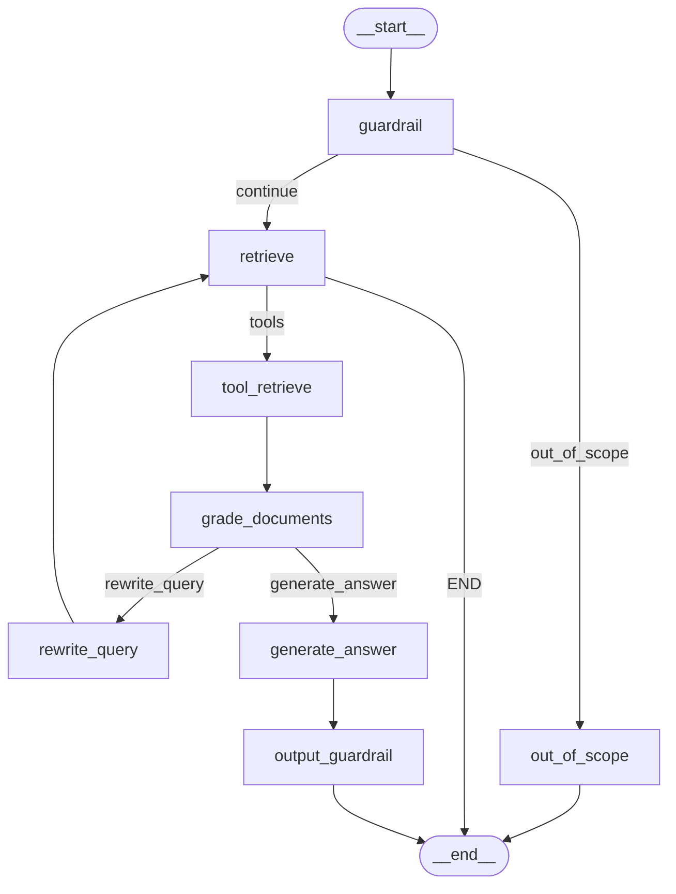

```mermaid
flowchart TD
    __start__(["__start__"])
    guardrail["guardrail"]
    out_of_scope["out_of_scope"]
    retrieve["retrieve"]
    tool_retrieve["tool_retrieve"]
    grade_documents["grade_documents"]
    rewrite_query["rewrite_query"]
    generate_answer["generate_answer"]
    output_guardrail["output_guardrail"]
    __end__(["__end__"])

    __start__ --> guardrail
    guardrail -->|continue| retrieve
    guardrail -->|out_of_scope| out_of_scope
    out_of_scope --> __end__
    retrieve -->|tools| tool_retrieve
    retrieve -->|END| __end__
    tool_retrieve --> grade_documents
    grade_documents -->|generate_answer| generate_answer
    grade_documents -->|rewrite_query| rewrite_query
    rewrite_query --> retrieve
    generate_answer --> output_guardrail
    output_guardrail --> __end__
```
