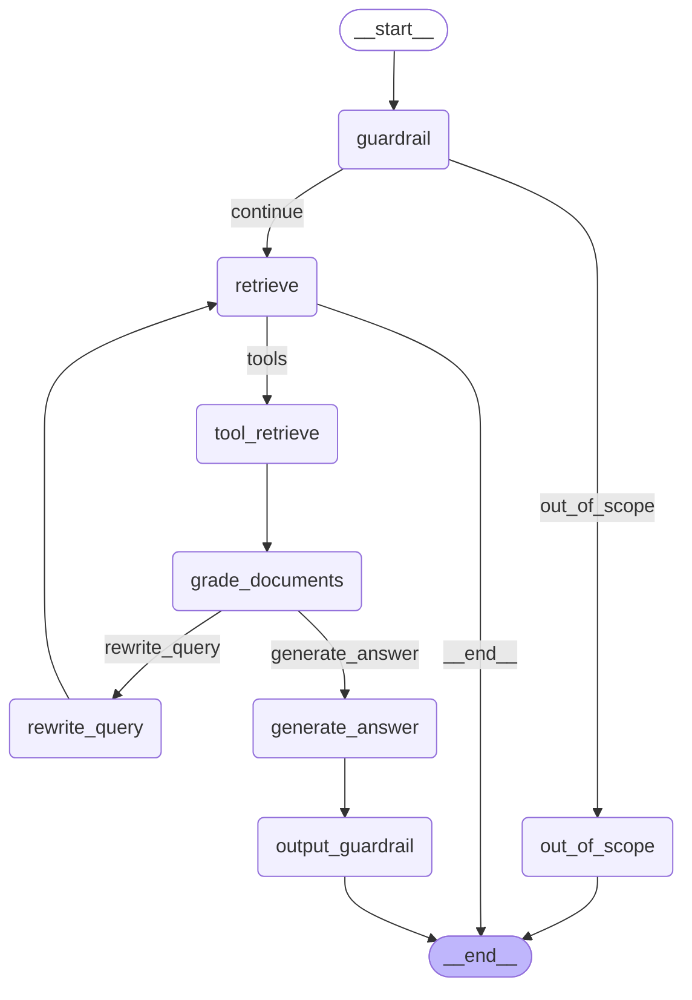

```mermaid
graph TD
    __start__([<p>__start__</p>]):::first
    guardrail(guardrail)
    out_of_scope(out_of_scope)
    retrieve(retrieve)
    tool_retrieve(tool_retrieve)
    grade_documents(grade_documents)
    rewrite_query(rewrite_query)
    generate_answer(generate_answer)
    output_guardrail(output_guardrail)
    __end__([<p>__end__</p>]):::last

    __start__ --> guardrail
    guardrail -->|continue| retrieve
    guardrail -->|out_of_scope| out_of_scope
    out_of_scope --> __end__
    retrieve -->|tools| tool_retrieve
    retrieve -->|__end__| __end__
    tool_retrieve --> grade_documents
    grade_documents -->|generate_answer| generate_answer
    grade_documents -->|rewrite_query| rewrite_query
    rewrite_query --> retrieve
    generate_answer --> output_guardrail
    output_guardrail --> __end__

    classDef default fill:#f2f0ff,line-height:1.2
    classDef first fill-opacity:0
    classDef last fill:#bfb6fc
```
