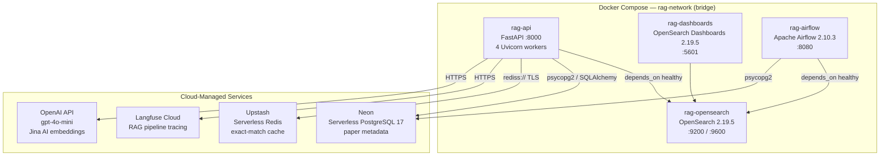

```mermaid
flowchart TD
    subgraph DOCKER["Docker Compose — rag-network (bridge)"]
        API["rag-api\nFastAPI :8000\n4 Uvicorn workers"]
        OS["rag-opensearch\nOpenSearch 2.19.5\n:9200 / :9600"]
        DASH["rag-dashboards\nOpenSearch Dashboards 2.19.5\n:5601"]
        AF["rag-airflow\nApache Airflow 2.10.3\n:8080"]

        API -->|depends_on healthy| OS
        AF -->|depends_on healthy| OS
        DASH --> OS
    end

    subgraph CLOUD["Cloud-Managed Services"]
        NEON["Neon\nServerless PostgreSQL 17\npaper metadata"]
        UPSTASH["Upstash\nServerless Redis\nexact-match cache"]
        LANGFUSE_C["Langfuse Cloud\nRAG pipeline tracing"]
        OPENAI_C["OpenAI API\ngpt-4o-mini\nJina AI embeddings"]
    end

    API -->|psycopg2 / SQLAlchemy| NEON
    API -->|rediss:// TLS| UPSTASH
    API -->|HTTPS| LANGFUSE_C
    API -->|HTTPS| OPENAI_C
    AF -->|psycopg2| NEON
```
