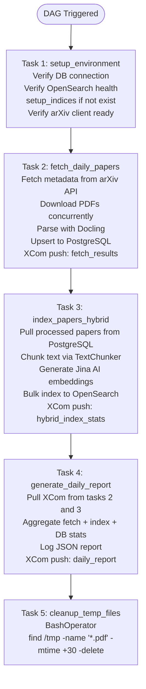

```mermaid
flowchart TD
    START([DAG Triggered]) --> T1

    T1["Task 1: setup_environment\nVerify DB connection\nVerify OpenSearch health\nsetup_indices if not exist\nVerify arXiv client ready"]

    T2["Task 2: fetch_daily_papers\nFetch metadata from arXiv API\nDownload PDFs concurrently\nParse with Docling\nUpsert to PostgreSQL\nXCom push: fetch_results"]

    T3["Task 3: index_papers_hybrid\nPull processed papers from PostgreSQL\nChunk text via TextChunker\nGenerate Jina AI embeddings\nBulk index to OpenSearch\nXCom push: hybrid_index_stats"]

    T4["Task 4: generate_daily_report\nPull XCom from tasks 2 and 3\nAggregate fetch + index + DB stats\nLog JSON report\nXCom push: daily_report"]

    T5["Task 5: cleanup_temp_files\nBashOperator\nfind /tmp -name '*.pdf' -mtime +30 -delete"]

    T1 --> T2 --> T3 --> T4 --> T5
```
