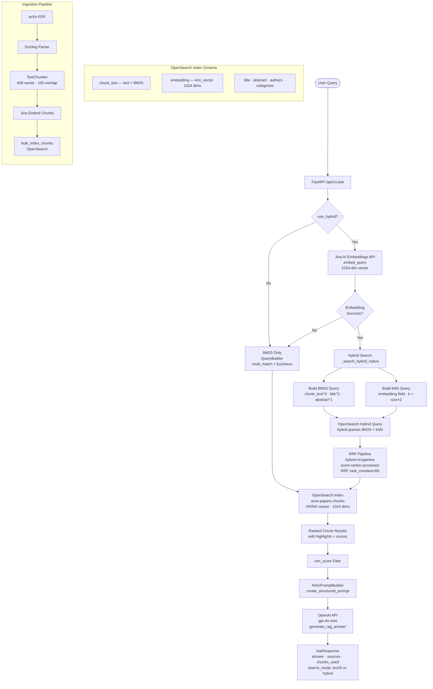

```mermaid
flowchart TD
    A([User Query]) --> B[FastAPI /api/v1/ask]

    B --> C{use_hybrid?}

    C -- No --> D[BM25 Only\nQueryBuilder\nmulti_match + fuzziness]
    C -- Yes --> E[Jina AI Embeddings API\nembed_query\n1024-dim vector]

    E --> F{Embedding\nSuccess?}
    F -- No --> D
    F -- Yes --> G[Hybrid Search\n_search_hybrid_native]

    G --> H[Build BM25 Query\nchunk_text^3 · title^2 · abstract^1]
    G --> I[Build kNN Query\nembedding field · k = size×2]

    H --> J[OpenSearch Hybrid Query\nhybrid.queries BM25 + kNN]
    I --> J

    J --> K[RRF Pipeline\nhybrid-rrf-pipeline\nscore-ranker-processor\nRRF rank_constant=60]

    D --> L[OpenSearch Index\narxiv-papers-chunks\nHNSW cosine · 1024 dims]
    K --> L

    L --> M[Ranked Chunk Results\nwith highlights + scores]

    M --> N[min_score Filter]
    N --> O[RAGPromptBuilder\ncreate_structured_prompt]

    O --> P[OpenAI API\ngpt-4o-mini\ngenerate_rag_answer]

    P --> Q[AskResponse\nanswer · sources · chunks_used\nsearch_mode: bm25 or hybrid]

    subgraph INDEX ["OpenSearch Index Schema"]
        direction TB
        R[chunk_text — text + BM25]
        S[embedding — knn_vector 1024 dims]
        T[title · abstract · authors · categories]
    end

    subgraph INGESTION ["Ingestion Pipeline"]
        direction TB
        U[arXiv PDF] --> V[Docling Parser]
        V --> W[TextChunker\n600 words · 100 overlap]
        W --> X[Jina Embed Chunks]
        X --> Y[bulk_index_chunks\nOpenSearch]
    end
```
