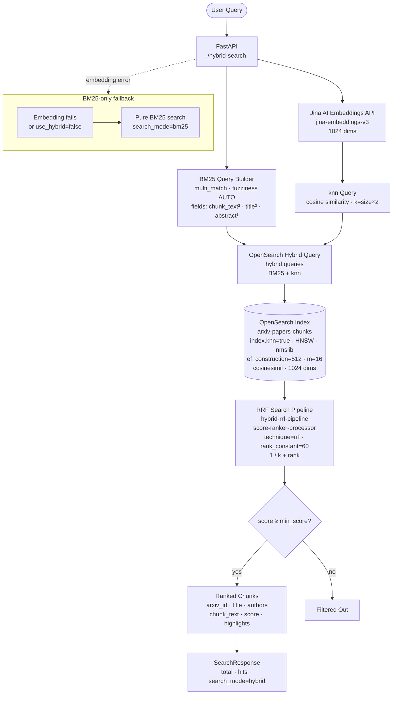

```mermaid
flowchart TD
    UserQuery([User Query]) --> API[FastAPI\n/hybrid-search]

    API --> Embed[Jina AI Embeddings API\njina-embeddings-v3\n1024 dims]
    API --> BM25Q[BM25 Query Builder\nmulti_match · fuzziness AUTO\nfields: chunk_text³ · title² · abstract¹]

    Embed --> VecQ[knn Query\ncosine similarity · k=size×2]

    BM25Q --> HybridQuery[OpenSearch Hybrid Query\nhybrid.queries\nBM25 + knn]
    VecQ --> HybridQuery

    HybridQuery --> OSIndex[(OpenSearch Index\narxiv-papers-chunks\nindex.knn=true · HNSW · nmslib\nef_construction=512 · m=16\ncosinesimil · 1024 dims)]

    OSIndex --> RRF[RRF Search Pipeline\nhybrid-rrf-pipeline\nscore-ranker-processor\ntechnique=rrf · rank_constant=60\n1 / k + rank]

    RRF --> MinScore{score ≥ min_score?}
    MinScore -- yes --> Results[Ranked Chunks\narxiv_id · title · authors\nchunk_text · score · highlights]
    MinScore -- no --> Drop[Filtered Out]

    Results --> SearchResponse[SearchResponse\ntotal · hits · search_mode=hybrid]

    subgraph Fallback [BM25-only fallback]
        direction LR
        NoEmbed[Embedding fails\nor use_hybrid=false] --> BM25Only[Pure BM25 search\nsearch_mode=bm25]
    end

    API -.->|embedding error| Fallback
```
