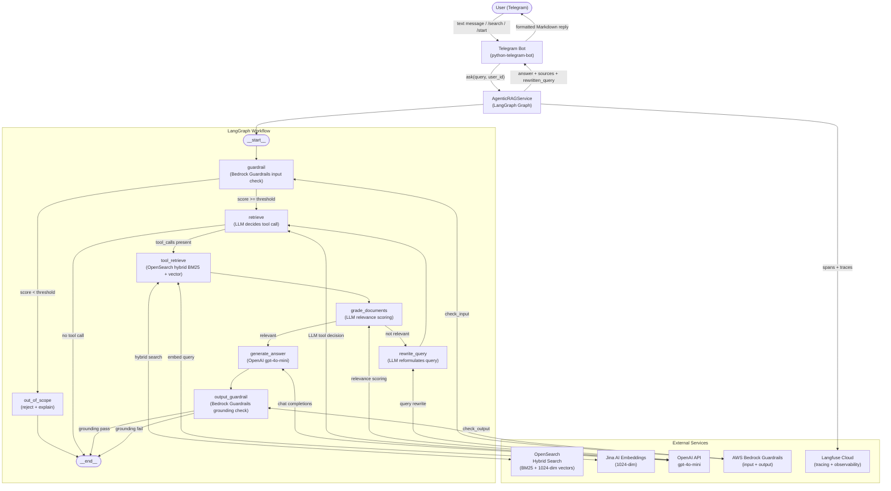

```mermaid
flowchart TD
    User(["User (Telegram)"])
    TelegramBot["Telegram Bot\n(python-telegram-bot)"]
    AgenticRAG["AgenticRAGService\n(LangGraph Graph)"]

    subgraph LangGraph["LangGraph Workflow"]
        direction TB
        START(["__start__"])
        guardrail["guardrail\n(Bedrock Guardrails input check)"]
        out_of_scope["out_of_scope\n(reject + explain)"]
        retrieve["retrieve\n(LLM decides tool call)"]
        tool_retrieve["tool_retrieve\n(OpenSearch hybrid BM25 + vector)"]
        grade_documents["grade_documents\n(LLM relevance scoring)"]
        rewrite_query["rewrite_query\n(LLM reformulates query)"]
        generate_answer["generate_answer\n(OpenAI gpt-4o-mini)"]
        output_guardrail["output_guardrail\n(Bedrock Guardrails grounding check)"]
        END_NODE(["__end__"])
    end

    subgraph ExternalServices["External Services"]
        OpenSearch["OpenSearch\nHybrid Search\n(BM25 + 1024-dim vectors)"]
        JinaEmbeddings["Jina AI Embeddings\n(1024-dim)"]
        OpenAI["OpenAI API\ngpt-4o-mini"]
        BedrockGuardrails["AWS Bedrock Guardrails\n(input + output)"]
        Langfuse["Langfuse Cloud\n(tracing + observability)"]
    end

    User -->|"text message / /search / /start"| TelegramBot
    TelegramBot -->|"ask(query, user_id)"| AgenticRAG
    AgenticRAG --> START

    START --> guardrail
    guardrail -->|"score >= threshold"| retrieve
    guardrail -->|"score < threshold"| out_of_scope
    out_of_scope --> END_NODE

    retrieve -->|"tool_calls present"| tool_retrieve
    retrieve -->|"no tool call"| END_NODE
    tool_retrieve --> grade_documents

    grade_documents -->|"relevant"| generate_answer
    grade_documents -->|"not relevant"| rewrite_query
    rewrite_query --> retrieve

    generate_answer --> output_guardrail
    output_guardrail -->|"grounding pass"| END_NODE
    output_guardrail -->|"grounding fail"| END_NODE

    guardrail <-->|"check_input"| BedrockGuardrails
    output_guardrail <-->|"check_output"| BedrockGuardrails
    tool_retrieve <-->|"hybrid search"| OpenSearch
    tool_retrieve <-->|"embed query"| JinaEmbeddings
    generate_answer <-->|"chat completions"| OpenAI
    retrieve <-->|"LLM tool decision"| OpenAI
    grade_documents <-->|"relevance scoring"| OpenAI
    rewrite_query <-->|"query rewrite"| OpenAI
    AgenticRAG -->|"spans + traces"| Langfuse

    AgenticRAG -->|"answer + sources + rewritten_query"| TelegramBot
    TelegramBot -->|"formatted Markdown reply"| User
```
