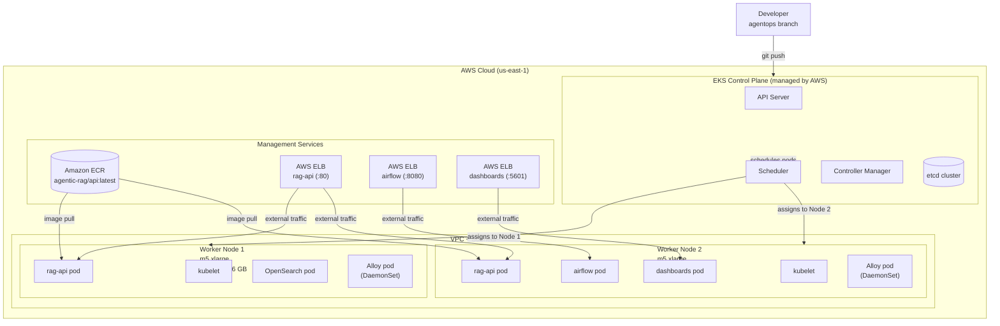

# 01 — EKS Cluster Architecture

This diagram shows the managed EKS control plane and the two worker nodes that actually run our pods.

## Key Concepts for Students

| Component | What It Does |
|---|---|
| **Control Plane** | Managed by AWS — you do not maintain the API server or etcd. You only interact via `kubectl`. |
| **Worker Node** | An EC2 instance (m5.xlarge) that runs kubelet and your containers. We have 2 of them. |
| **kubelet** | The agent on each node that talks to the control plane and starts/stops containers. |
| **Scheduler** | Decides which node a new pod should land on based on CPU, memory, and anti-affinity rules. |
| **ECR** | Docker image registry. Images built in GitHub Actions are pushed here, then pulled by nodes. |
| **ELB** | AWS Load Balancer created automatically when you apply a `LoadBalancer` service in Kubernetes. |

## Why m5.xlarge?

We chose `m5.xlarge` (4 vCPU, 16 GB) over `t3.medium` (2 vCPU, 4 GB) because:
- Each `rag-api` pod requests **6 GB memory** at baseline
- A single OpenSearch pod needs **~3 GB**
- `t3.medium` (4 GB total) cannot even fit one `rag-api` pod
- `m5.xlarge` fits ~2 `rag-api` pods + OpenSearch + system overhead per node
