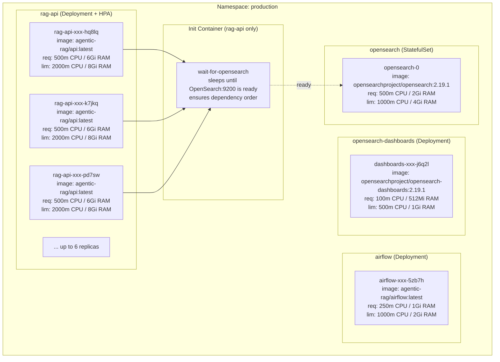

# 02 — Pod Layout in the Production Namespace

This diagram shows every pod that runs inside the `production` namespace, its container image, and its resource request / limit boxes. Notice that only `rag-api` is managed by HPA (can grow from 2 to 6 replicas).

## Resource Math for Students

| Pod | Request CPU | Request RAM | Limit CPU | Limit RAM |
|---|---|---|---|---|
| rag-api (×2 min) | 500m | **6 Gi** | 2000m | **8 Gi** |
| airflow | 250m | 1 Gi | 1000m | 2 Gi |
| opensearch | 500m | 2 Gi | 1000m | 4 Gi |
| dashboards | 100m | 512 Mi | 500m | 1 Gi |
| **Total minimum** | **1350m** | **~9.5 Gi** | — | — |

## Why the rag-api Pod Is Special

1. **It has an init container** (`wait-for-opensearch`) that delays startup until OpenSearch is healthy. This prevents connection errors on first boot.
2. **It is the only HPA-managed pod** — it can scale from 2 to 6 replicas under load.
3. **It has the highest resource footprint** because it loads PyTorch, LangGraph, and boto3 into memory at startup (~2.7 GB baseline).

## Why We Hit a Ceiling

With **6 Gi RAM request** per `rag-api` pod and **16 Gi total** per node:
- Node 1: 6 + 2 (OpenSearch) + system = ~9 GB used → ~7 GB free
- Node 2: 6 + 1 (airflow) + 0.5 (dashboards) + system = ~8 GB used → ~8 GB free

A **3rd rag-api pod needs 6 Gi free**, but neither node has that much contiguous free memory. This is why HPA gets stuck at 2 replicas unless we lower the request.
