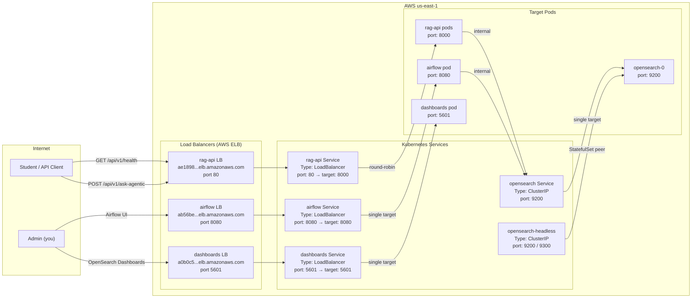

# 03 — Services & Ingress

This diagram shows how external traffic from the internet reaches our pods. Some services are exposed via AWS ELB (`LoadBalancer` type) and some are internal-only (`ClusterIP` type).

## Service Types Explained

| Type | External IP | Use Case | Our Services |
|---|---|---|---|
| **LoadBalancer** | Yes — AWS creates an ELB | User-facing endpoints | rag-api, airflow, dashboards |
| **ClusterIP** | No — internal only | Pod-to-pod communication | opensearch, opensearch-headless |

## Why opensearch-headless?

OpenSearch is a **StatefulSet** (not a Deployment). It needs a stable network identity so that:
- Each pod keeps the same hostname after restart
- Peer discovery inside the cluster works via DNS
- Data stored on the persistent volume is re-attached to the same pod

The `opensearch-headless` service is `ClusterIP` with `clusterIP: None` — this creates a DNS record for every pod individually (`opensearch-0.opensearch-headless.production.svc.cluster.local`), which is required for StatefulSet peer discovery.

## Round-Robin Load Balancing

The `rag-api` Service is a `LoadBalancer` with **multiple pods** behind it. Kubernetes Services use `iptables` or `IPVS` to distribute traffic evenly across all ready pods. When HPA scales from 2 → 6 replicas, the Service automatically starts sending traffic to the new pods without any manual config change.
