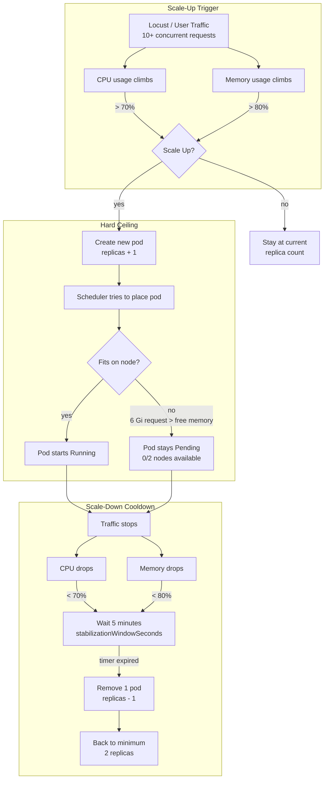

# 04 — Horizontal Pod Autoscaler (HPA) Scaling Behavior

This diagram shows how HPA decides to add or remove pods based on CPU and memory metrics. It also highlights the stabilization window and the scheduling bottleneck we discovered.



## HPA Configuration We Applied

```yaml
apiVersion: autoscaling/v2
kind: HorizontalPodAutoscaler
metadata:
  name: rag-api-hpa
spec:
  scaleTargetRef:
    apiVersion: apps/v1
    kind: Deployment
    name: rag-api
  minReplicas: 2
  maxReplicas: 6
  metrics:
    - type: Resource
      resource:
        name: cpu
        target:
          type: Utilization
          averageUtilization: 70
    - type: Resource
      resource:
        name: memory
        target:
          type: Utilization
          averageUtilization: 80
  behavior:
    scaleDown:
      stabilizationWindowSeconds: 300   # 5 minutes
      policies:
        - type: Percent
          value: 100
          periodSeconds: 15
```

## The Two Scaling Tensions

| Tension | What Happened | Lesson |
|---|---|---|
| **Horizontal vs Vertical** | We raised memory request to 6 Gi (vertical) to prevent OOMKills, but this prevented HPA from creating a 3rd pod (horizontal) | You cannot scale both axes independently — they compete for the same node resources |
| **Stabilization Window** | After Locust stopped, HPA waited 5 minutes before removing pods | This prevents flapping (rapid add/remove) but means you pay for extra pods briefly |

## What Students Should Remember

1. **HPA reads metrics from Metrics Server** (not from `kubectl top` directly — `top` is just a CLI wrapper).
2. **Scale-up is immediate** — as soon as the average across all pods exceeds the target, a new pod is requested.
3. **Scale-down is cautious** — Kubernetes waits 5 minutes to be sure the load is actually gone.
4. **A pod is not a pod until it is scheduled** — if nodes are full, HPA shows the desired replica count but the pod stays `Pending`.
