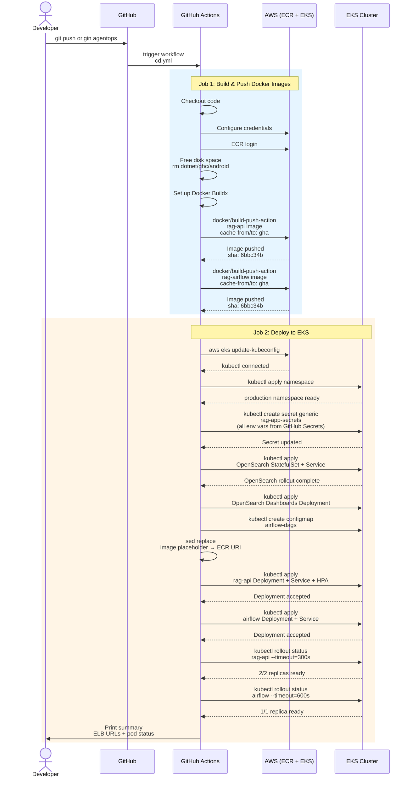

# 05 — CI/CD Pipeline: GitHub Actions to EKS

This sequence diagram shows the complete flow from `git push` on the `agentops` branch to a rolling update on the EKS cluster.



## Why Two Jobs?

| Job | Runs on | Purpose | Output |
|---|---|---|---|
| **build-and-push** | `ubuntu-latest` | Build Docker images, push to ECR | `api-image` + `airflow-image` URIs |
| **deploy** | `ubuntu-latest` | Run kubectl against EKS | Live cluster updated |
| **needs** dependency | — | Deploy waits for build to finish | Prevents deploying a failed build |

## Concurrency Protection

```yaml
concurrency:
  group: deploy-production
  cancel-in-progress: true
```

This means if you push twice in quick succession, the **older run is cancelled** and the newer one takes over. This prevents two deployments from fighting each other.

## Rolling Update Strategy

When the deployment is applied, Kubernetes does a **rolling update**:
1. Create 1 new pod with the new image
2. Wait for it to be Ready
3. Delete 1 old pod
4. Repeat until all pods are new

This ensures **zero downtime** — the old pods keep serving traffic until the new ones are healthy.

## The Disk-Space Fix

Our first CI run failed with:
```
System.IO.IOException: No space left on device
```

The fix was three-fold:
1. **Free up disk** — remove pre-installed .NET, GHC, Android SDK (~10 GB)
2. **Switch to `docker/build-push-action`** — uses GitHub Actions cache backend (`type=gha`) instead of storing layers on disk
3. **Buildx** — enables advanced caching without intermediate layer bloat
