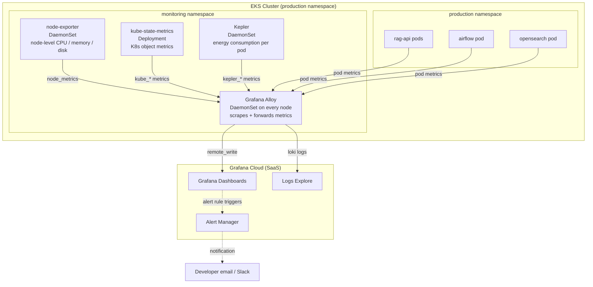

# 06 — Monitoring Stack: Grafana Cloud on EKS

This diagram shows how metrics and logs flow from the EKS cluster up to Grafana Cloud using the `grafana-k8s-monitoring` Helm chart.



## What Each Component Does

| Component | Type | What It Collects |
|---|---|---|
| **Grafana Alloy** | DaemonSet (1 per node) | Scrapes all Prometheus endpoints and pushes to Grafana Cloud |
| **kube-state-metrics** | Deployment | Kubernetes object metrics: pod counts, deployment status, HPA replica counts |
| **node-exporter** | DaemonSet | Node-level hardware metrics: CPU, memory, disk I/O, network |
| **Kepler** | DaemonSet | Energy consumption per pod (useful for cost and sustainability tracking) |

## Why a Separate `monitoring` Namespace?

Keeping monitoring tools in their own namespace (`monitoring`) provides:
- **Isolation** — monitoring pods restart/redeploy independently of app pods
- **RBAC** — you can grant monitoring service accounts read-only access to cluster metrics without giving them access to app secrets
- **Cleanup** — delete the namespace and the entire monitoring stack disappears

## Helm Install Command We Used

```bash
helm upgrade --install grafana-k8s-monitoring \
  grafana/k8s-monitoring \
  --namespace monitoring \
  --create-namespace \
  --version 4.1.3 \
  --values deployment/grafana/values.yaml
```

The `values.yaml` contains the `GRAFANA_CLOUD_TOKEN` that authenticates Alloy to push data to your Grafana Cloud account.

## What Students Can See in Grafana

After logging into [grafana.com](https://grafana.com):
- **Kubernetes / Compute Resources / Namespace (Pods)** — CPU and memory per pod over time
- **Kubernetes / Compute Resources / Cluster** — cluster-wide resource usage
- **Node Exporter / Nodes** — disk space, network throughput, load average
- **Logs** — raw container logs from all namespaces, searchable by pod name
