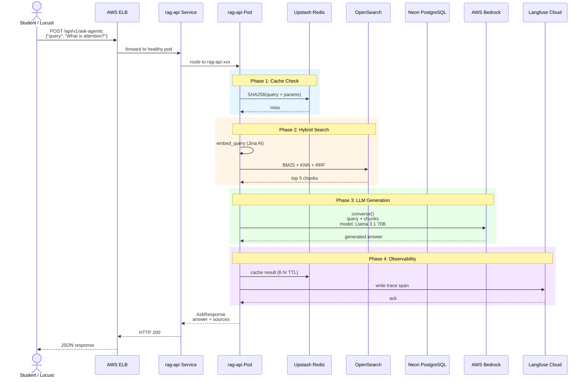

# 07 — Request Flow Through Kubernetes

This sequence diagram traces a single `POST /api/v1/ask-agentic` request from the student's browser all the way to Bedrock and back.



## What Happens Inside the Pod?

When the request hits the `rag-api` pod, FastAPI routes it to the `ask_agentic` endpoint. Inside that endpoint, a **LangGraph state machine** runs:

1. **guardrail_node** — LLM scores the query 0-100. If < 60, return "out of scope" immediately.
2. **retrieve_node** — LLM decides whether to call the `retrieve_papers` tool.
3. **tool_retrieve** — Executes hybrid search against OpenSearch (the same call shown above).
4. **grade_documents_node** — LLM checks if retrieved chunks are relevant.
5. **generate_answer_node** — LLM produces the final answer using relevant chunks.

If documents are not relevant and `retrieval_attempts < 2`, the graph loops back to **rewrite_query_node** → **retrieve_node** for one more try.

## Parallel Calls

Notice that the hybrid search (OpenSearch) and the cache check (Redis) happen in parallel where possible. The PostgreSQL database is only queried when:
- Looking up full paper metadata for source URLs
- The Airflow DAG writes new papers during ingestion

## Why Bedrock Is the Bottleneck

Every successful request makes **at least one Bedrock call** (guardrail + retrieve + generate can be 3+ calls). Bedrock has:
- **Rate limits** per account per region
- **Latency** of 10–30 seconds per call for Llama 3.1 70B
- **Cost** per input/output token

This is why 10,000 concurrent requests would fail instantly — not because of Kubernetes, but because Bedrock would throttle us.

## The Complete Data Path

```
Student Browser
    ↓
AWS ELB (rag-api LoadBalancer Service)
    ↓
Kubernetes Service → round-robin to a ready pod
    ↓
FastAPI / uvicorn worker
    ↓
LangGraph node chain
    ↓
OpenSearch (internal ClusterIP)  ←──┐
Redis (Upstash Cloud)               ──┤  parallel where possible
Bedrock (AWS us-east-1)             ──┘
    ↓
Response JSON back to browser
```
